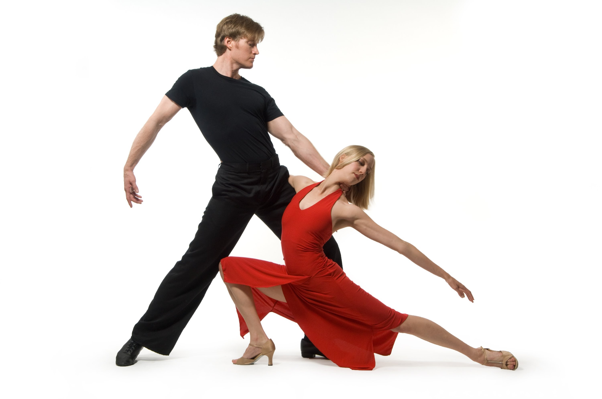

# Ivan Hernandez Individual Project

### Problem Statement

People get together in a class room to take salsa or bachata dance style where they can either learn a new dance style or improve the dance skills they already
have. Whether you are interested in wedding dance instruction, are looking for a new hobby or way to connect with your partner, want to improve your social life, 
or are taking your dancing skills to the next level, taking dance lessons on SALSA STUDIO you will find a welcoming community of diversity race of latinos, 
african american, asians or white americans where they all treat very nice to each other because they all love to dance.

The major issue the SALSA STUDIO is having is to know the crowed or how many people will be in each lessons or class, not to know this information is vital
because sometimes people or students expect to have equal even or close number of men and women to partner with, the method we use in the lesson is to rotate partner 
this way you can have a different experience of each partner every time you dance, sometimes a class session can have more men than women or viceversa, this is 
critical because when this happen people cannot not enjoy the whole lesson of dancing because they need to wait for the next available partner on every rotation.

an solution we want to implement is to have a guest check in web app where people can go online log into a dance lesson class to be expected in it, this will
create a list of expected guest or people and anyone before class can go online and see this list of expected guest to have an idea on how crowed the coming class
will be.

### Project Technologies/Techniques 

* Authentication
  * Admin role: create/read/update/delete (crud) information/users/data in the system
  * User role: sign up for dance lessons
  * All: anyone can view the list of available lessons and the list of expeted guest (no login required)
* Database (MySQL and Hibernate)
  * Store users, teachers or host
  * Store dance lessons informations
  * Store a history previuos lessons
* Logging
  * Create a reports of potencial errors occur in the system.
* Site and database hosted on AWS
* Unit Testing
  * JUnit tests to achieve 80% code coverage 

### Design

* [Screen Design](DesignDocuments/Screens.md)
* [Application Flow](DesignDocuments/applicationFlow.md)
* [Database Design](DesignDocuments/databaseDiagram.png)

### [Project Plan](ProjectPlan.md)

### [Time Log](TimeLog.md) 
### [Journal](Journal.md)
