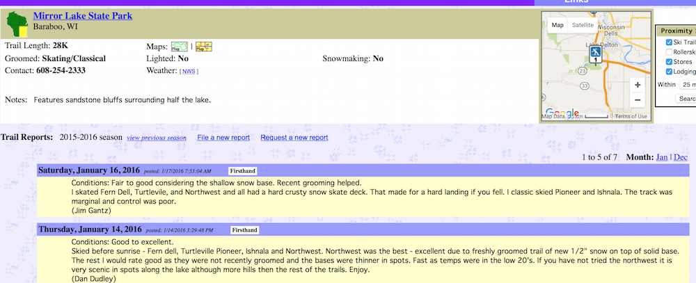
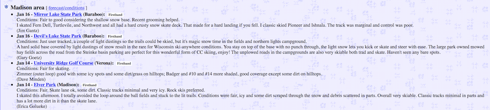

# Paula Waite Individual Project

This repository will serve as an example for the Fall 2017 Enterprise Java Class. 

### Problem Statement

For over 20 years, cross-country (XC) ski enthusiasts in the midwest have relied on [SkinnySki.com](https://www.skinnyski.com) as the go-to website for cross-country ski information. The site has information on XC ski races, training, tips and trails.  The trail data includes descriptions, location/driving directions, trail maps, trail type (skate versus classic) and conditions (rolled, tracked, skiied in). While most trail systems have their own websites with this type of information, SkinnySki's benefit is that all the trail information is located in one place.  Even better, users are encouraged to add their own trail reports which means SkinnySki.com tends to be the most current source of information.  

With the growing popularity of winter fat biking (riding bikes with 3.5" or larger tires in the snow), riders have found themselves in need of a site similar to SkinnySki.com to discover and share fat bike trails and conditions. Currently, trail information is found on various social media sites and web sites, or is simply shared in email among those "in the know". I'd like to build a Fat Bike Trail Reports website to serve as the SkinnySki.com for fat biking. 

Screenshots from SkinnySki.com:

### Project Technologies/Techniques 

* Security/Authentication
  * Admin role: create/read/update/delete (crud) of all data
  * User role: submit trail reports
  * All: anyone can view trail information (no login required)
* Database (MySQL and Hibernate)
  * Store users and roles
  * Store trail information
* Web Services or APIs
  * Google Maps for trail locations
  * Weather for weather conditions at a trail location
* Jenkins (independent research topic)
* Logging
  * Configurable logging using Log4J. In production, only errors will normally be logged, but logging at a debug level can be turned on to facilitate trouble-shooting. 
* Site and database hosted on AWS
* Unit Testing
  * JUnit tests to achieve 80% code coverage 

### Design

* [Screen Design](DesignDocuments/Screens.md)
* [Application Flow](DesignDocuments/applicationFlow.md)
* [Database Design](DesignDocuments/databaseDiagram.png)

### [Project Plan](ProjectPlan.md)

### [Time Log](TimeLog.md) 
### [Journal](Journal.md)
